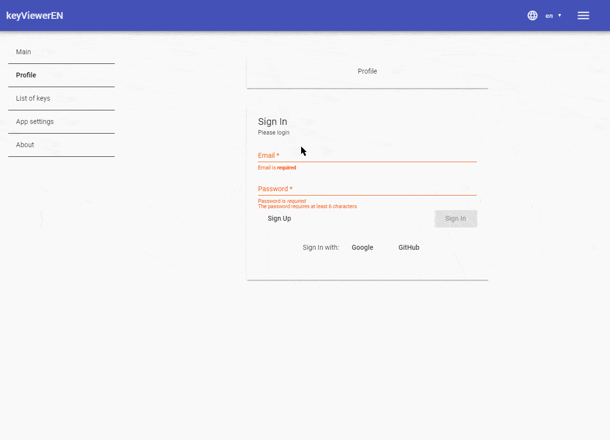
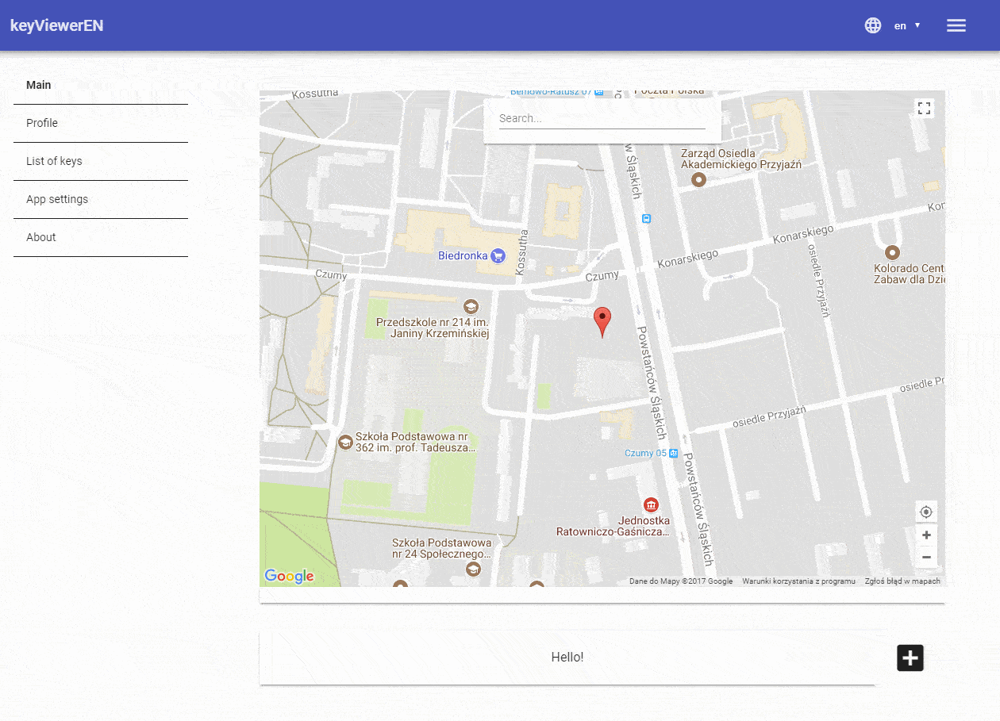
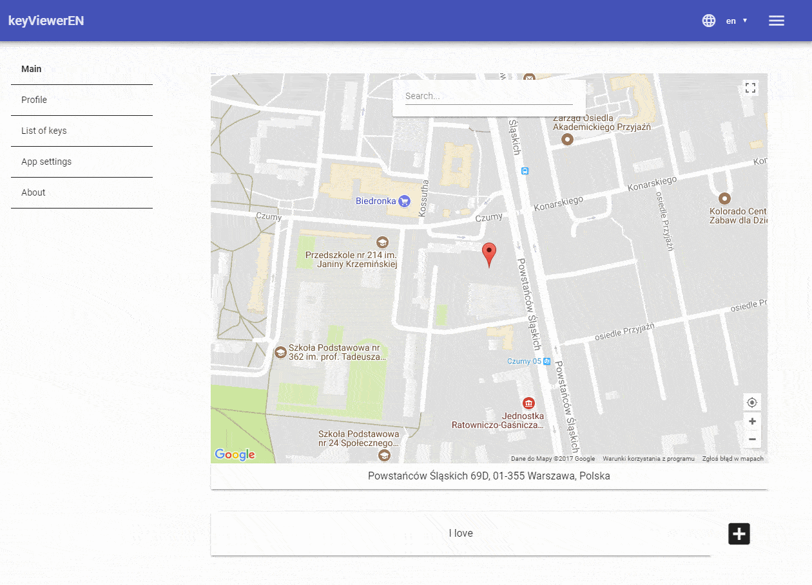
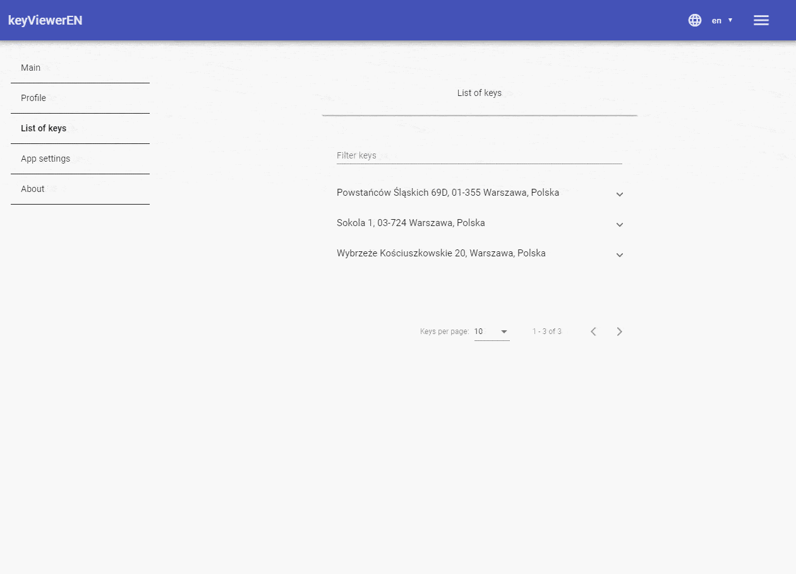
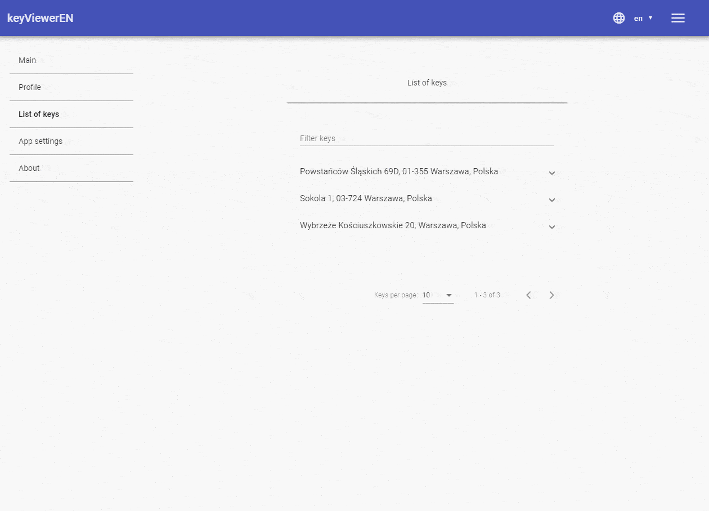
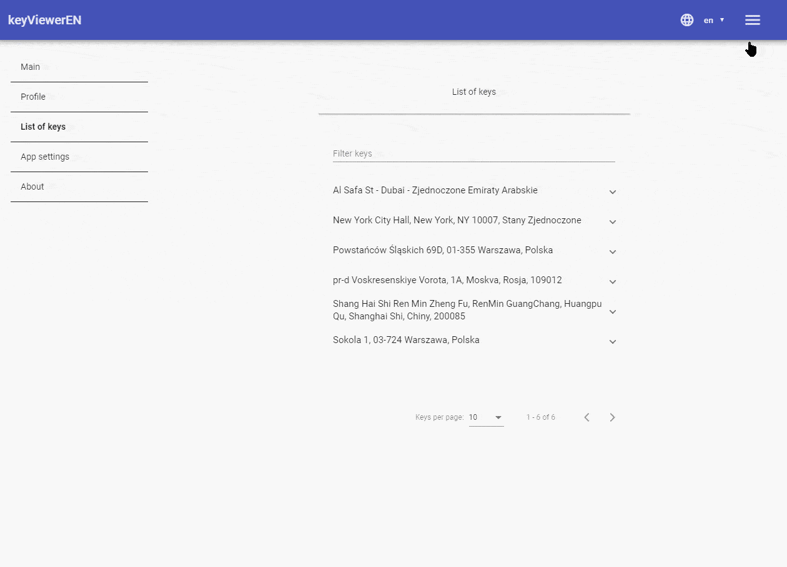
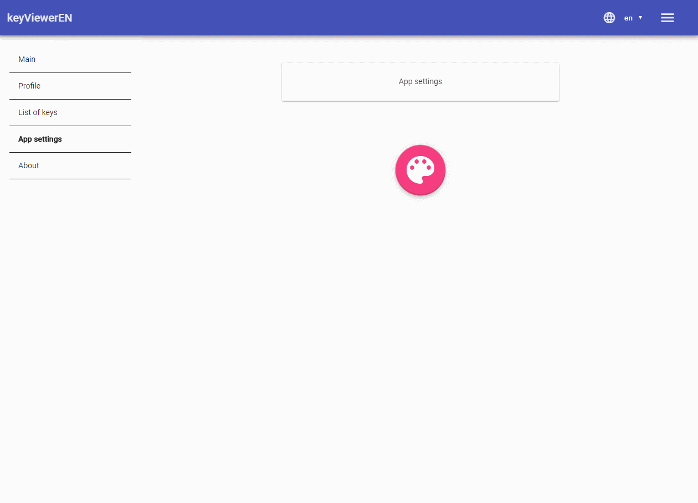

# keyViewer
> Hello! Feel free to sign up to the application, and use it to make your life easier :)

## Introduction
[Live preview](https://keyviewer-d5825.firebaseapp.com/)

###App purpose

Created to help me with my work. In short words. 
I create a note based on location.
And app shows me the note/key which is nearest to my current location.
And that is it. App is simple, good looking, and save my time.

## Showcase
Get acces to the app


Add new items


Edit item


Edit item from the items list


Delete item


Filtering the list of items


Change app theme


# Repository documentation

This project was generated with [Angular CLI](https://github.com/angular/angular-cli) version 1.1.1.

## Installing / Getting started

A quick introduction of the minimal setup you need to get a hello world up &
running.

```shell
commands here
```

Here you should say what actually happens when you execute the code above.

## Development server

Run `ng serve` for a dev server. Navigate to `http://localhost:4200/`. The app will automatically reload if you change any of the source files.

## Code scaffolding

Run `ng generate component component-name` to generate a new component. You can also use `ng generate directive|pipe|service|class|module`.

## Build

Run `ng build` to build the project. The build artifacts will be stored in the `dist/` directory. Use the `-prod` flag for a production build.

## Running unit tests

Run `ng test` to execute the unit tests via [Karma](https://karma-runner.github.io).

## Running end-to-end tests

Run `ng e2e` to execute the end-to-end tests via [Protractor](http://www.protractortest.org/).
Before running the tests make sure you are serving the app via `ng serve`.

## Style guide

Explain your code style and show how to check it.

## Api Reference

If the api is external, link to api documentation. If not describe your api including authentication methods as well as explaining all the endpoints with their required parameters.

## Database

Explaining what database (and version) has been used. Provide download links.
Documents your database design and schemas, relations etc... 

## Further help

To get more help on the Angular CLI use `ng help` or go check out the [Angular CLI README](https://github.com/angular/angular-cli/blob/master/README.md).

## Licensing

State what the license is and how to find the text version of the license.

